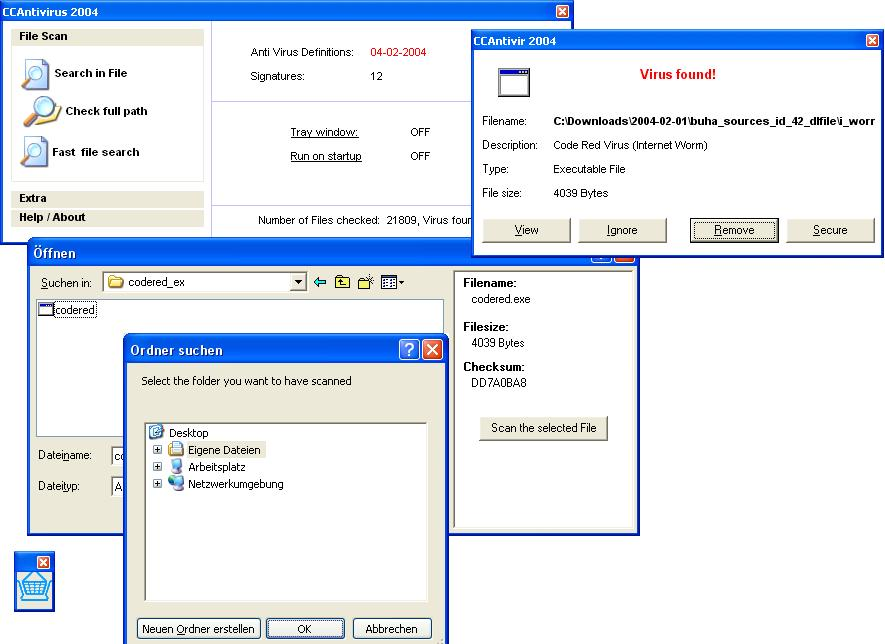



## Antivirus 2004 \(2\.2\)

### Description

This is number two of my Anti Virus Program!

Now the software is able to detect every virus by scanning for checksums (again: Only the viruses wich are mentioned in the DB). The demo db includes the checksums of some popular Virii (e.g. Code Red, Klez, Magistrar + Eicar Testvirus). I have completeley over worked the Scaning algorithm. It is now able to scann 150MB (~7000 Files) within 35s. That means it is three times faster than my previous version! I have also totally changed the GUI: It has move-down menues like the Explorer has. Other new stuff: 1) There's also a function that scans a whole directory (and sub folders) for virii. 2) "Fast file search" function this is a manipulated cDialog that allows to scan the file without leaving the cDialog! 3) There's also a possibility to "secure" files. This is like a quarantaine function: It stores the file encrypted to prevent it from beeing executed!
 
### More Info
 

             |
---                |---
**Submitted On**   |2004-02-12 19:15:56
**By**             |[Cyber Chris](https://github.com/Planet-Source-Code/PSCIndex/blob/master/ByAuthor/cyber-chris.md)
**Level**          |Advanced
**User Rating**    |4.9 (428 globes from 87 users)
**Compatibility**  |VB 3\.0, VB 4\.0 \(16\-bit\), VB 4\.0 \(32\-bit\), VB 5\.0, VB 6\.0
**Category**       |[Complete Applications](https://github.com/Planet-Source-Code/PSCIndex/blob/master/ByCategory/complete-applications__1-27.md)
**World**          |[Visual Basic](https://github.com/Planet-Source-Code/PSCIndex/blob/master/ByWorld/visual-basic.md)
**Archive File**   |[Antivirus\_1710782192004\.zip](https://github.com/Planet-Source-Code/cyber-chris-antivirus-2004-2-2__1-51592/archive/master.zip)

